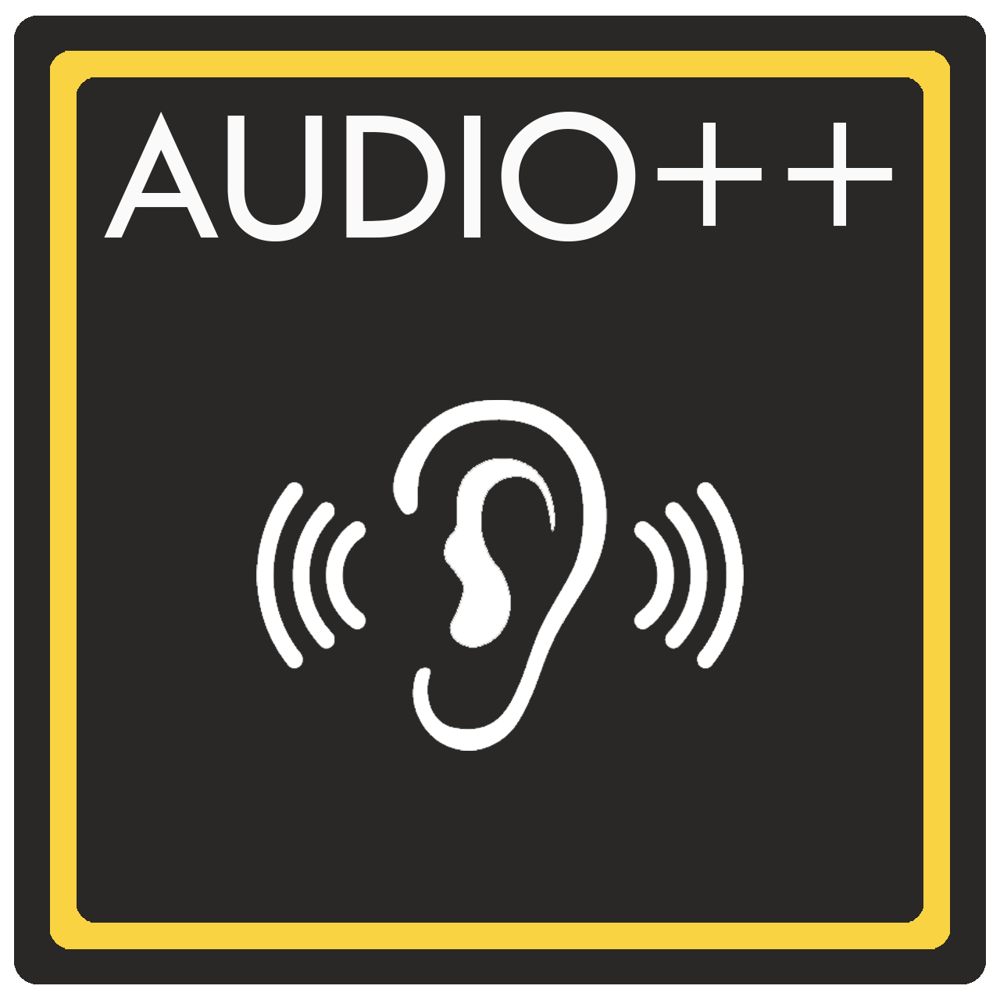

# AudioPlusPlus

## About AudioPlusPlus
AudioPlusPlus (A++) is an early development audio playback library designed for easy integration with any programs.

A++ is currently in very early development stages. Please consider helping by checking out the roadmap here - https://trello.com/b/67YcKpif/audioplusplus

# How to build
1. Clone this repository to your machine using `git clone --recursive https://github.com/callumc34/AudioPlusPlus`
    - You may need to run `git submodule init` if you did not clone recusively
2. Build PortAudio using the instructions here http://files.portaudio.com/docs/v19-doxydocs/tutorial_start.html
3. Build spdlog using CMake
4. Open the AudioPlusPlus MSVC solution and build using Visual Studio.

# Examples
Check out the examples folder for how to integrate into your app.
